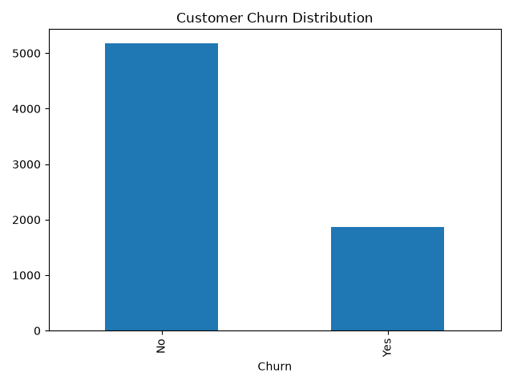
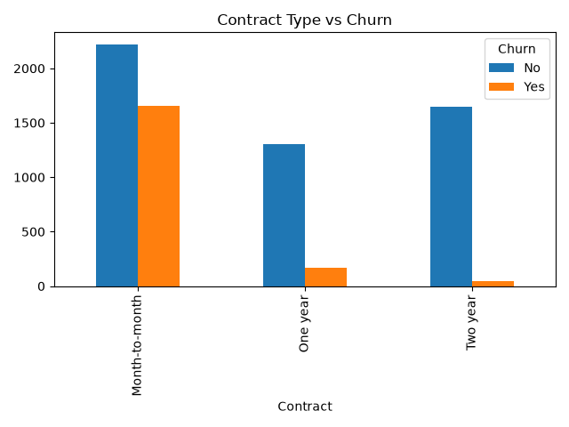
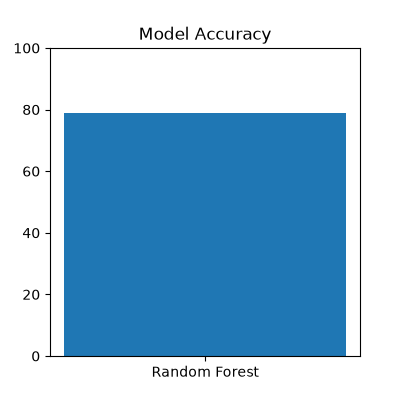

# Customer Analytics & Churn Prediction Platform

## Overview

Customer churn is one of the biggest challenges faced by subscription-based businesses. This project focuses on analyzing customer behavior, identifying churn patterns, and building a machine learning model to predict customer attrition.

The project combines Data Analytics, SQL, Machine Learning, and Business Intelligence concepts to generate actionable insights that can help organizations improve customer retention and reduce revenue loss.

---

## Business Problem

Customer retention is more cost-effective than customer acquisition. Companies need to understand:

- Why customers leave
- Which customers are at risk of churning
- Factors affecting customer retention
- How to improve customer loyalty

This project addresses these challenges through data-driven analysis and predictive modeling.

---

## Project Objectives

- Analyze customer behavior and churn trends
- Identify key factors affecting customer retention
- Perform data cleaning and preprocessing
- Build a machine learning model for churn prediction
- Generate actionable business insights
- Support data-driven decision-making

---

## Dataset

**Dataset:** IBM Telco Customer Churn Dataset

The dataset contains customer information such as:

- Customer ID
- Gender
- Senior Citizen Status
- Partner Status
- Dependents
- Tenure
- Phone Service
- Internet Service
- Contract Type
- Payment Method
- Monthly Charges
- Total Charges
- Churn Status

### Dataset Statistics

| Metric | Value |
|----------|----------|
| Total Records | 7043 |
| Features | 21 |
| Churned Customers | 1869 |
| Retained Customers | 5174 |
| Churn Rate | 26.54% |

---

## Technology Stack

| Technology | Purpose |
|------------|---------|
| Python | Data Analysis & Machine Learning |
| Pandas | Data Cleaning & Transformation |
| NumPy | Numerical Computation |
| Scikit-Learn | Machine Learning |
| SQL | Business Analysis Queries |
| Matplotlib | Data Visualization |
| Git & GitHub | Version Control |
| Power BI | Dashboard Development (Planned) |

---

## Project Structure

```text
Customer-Analytics-Churn-Prediction/
│
├── Dataset/
│   ├── Telco-Customer-Churn.csv
│   └── cleaned_churn.csv
│
├── Python/
│   ├── data_cleaning.py
│   ├── analysis.py
│   ├── churn_prediction.py
│   └── visualizations.py
│
├── SQL/
│   └── churn_queries.sql
│
├── PowerBI/
│   └── README.md
│
├── Screenshots/
│   ├── churn_distribution.png
│   ├── contract_analysis.png
│   └── model_accuracy.png
│
├── requirements.txt
├── .gitignore
└── README.md
```

---

## Project Workflow

### 1. Data Cleaning

Performed:

- Dataset loading
- Data validation
- Duplicate removal
- Missing value analysis
- Data type conversion

Output:

```text
cleaned_churn.csv
```

---

### 2. Exploratory Data Analysis (EDA)

Analyzed:

- Customer churn distribution
- Contract type impact on churn
- Monthly charges analysis
- Customer tenure analysis
- Customer retention trends

---

### 3. Machine Learning

Algorithm Used:

- Random Forest Classifier

Steps:

- Feature Engineering
- One-Hot Encoding
- Train-Test Split
- Model Training
- Model Evaluation

---

## Model Performance

### Churn Prediction Accuracy

```text
78.92%
```

The model successfully predicts customer churn behavior using customer demographic and service-related attributes.

---

## Key Findings

### 1. Customer Churn Rate

| Metric | Value |
|----------|----------|
| Total Customers | 7043 |
| Churned Customers | 1869 |
| Churn Rate | 26.54% |

**Insight:**

Approximately 1 in 4 customers leave the company, indicating a significant retention challenge.

---

### 2. Contract Type Analysis

| Contract Type | Churned Customers |
|---------------|-------------------|
| Month-to-Month | 1655 |
| One Year | 166 |
| Two Year | 48 |

**Insight:**

Customers with month-to-month contracts are significantly more likely to churn than customers with long-term contracts.

---

### 3. Monthly Charges Analysis

| Customer Type | Average Monthly Charges |
|--------------|-------------------------|
| Retained Customers | 61.27 |
| Churned Customers | 74.44 |

**Insight:**

Customers paying higher monthly charges are more likely to churn.

---

### 4. Customer Tenure Analysis

| Customer Type | Average Tenure |
|--------------|---------------|
| Retained Customers | 37.57 Months |
| Churned Customers | 17.98 Months |

**Insight:**

Customers with shorter tenure are at a higher risk of leaving the company.

---

## Business Recommendations

### Recommendation 1

Promote long-term contracts through discounts and loyalty programs.

### Recommendation 2

Improve customer onboarding and engagement during the first year.

### Recommendation 3

Provide personalized offers for customers with high monthly charges.

### Recommendation 4

Improve customer support and proactive retention strategies.

---

## SQL Analytics

The project includes SQL queries for:

- Total Customer Analysis
- Churn Rate Calculation
- Contract-wise Churn Analysis
- Monthly Charges Analysis
- Customer Segmentation

---

## Future Enhancements

- Power BI Interactive Dashboard
- Streamlit Web Application
- Advanced Machine Learning Models
- Customer Lifetime Value Prediction
- Real-Time Churn Prediction
- Cloud Deployment (AWS/GCP/Azure)

---

## Project Screenshots

### Customer Churn Distribution



### Contract Type vs Churn



### Model Accuracy



---

## Business Impact

This project demonstrates how Data Analytics and Machine Learning can help organizations:

- Reduce customer churn
- Improve customer retention
- Increase revenue
- Identify high-risk customers
- Support strategic business decisions

---

## Author

**Amruta Kanchagar**

Aspiring Data Analyst | Python | SQL | Power BI | Machine Learning

GitHub: https://github.com/AmrutaKanchagar

---

## License

This project is developed for educational and portfolio purposes.